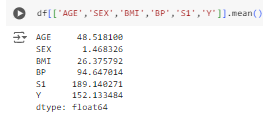
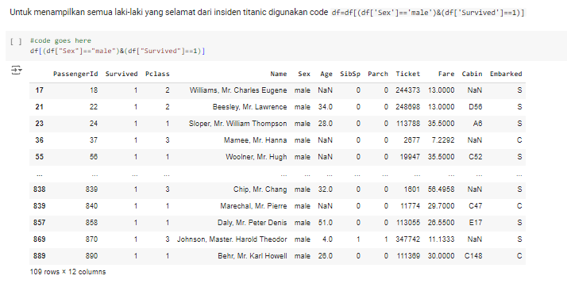
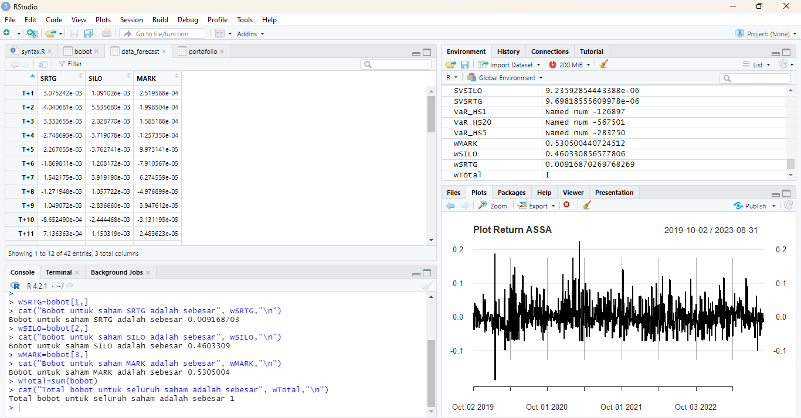

# Portfolio
---
## Dashboard - Looker Studio Project
### Data: Data Kependudukan Desa Pakisan

[View in Looker Studio](https://lookerstudio.google.com/reporting/3ceeb544-e9bc-4cbd-992a-d4845337dbd3)

### Data: COVID-19 Week 5 Global Dataset

[View in Looker Studio](https://lookerstudio.google.com/reporting/4ff8e5bd-cf9c-4a5c-8073-5335a290a777)

---

## SQL Project

Structured Query Language (SQL) is a standardized programming language that is used to manage relational databases and perform various operations on the dataset. In this project, the tools and the dataset that used are PostgreSQL and DVD Rental Dataset. By using PostgreSQL, there are some cases that must be solved with SQL query.

1. Identify the top 10 customers and their email so we can reward them. 
2. Identify the bottom 10 customers and their emails. 
3. What are the most profitable movie genres (ratings)? 
4. How many rented movies were returned late, early, and on time? 
5. What is the customer base in the countries where we have a presence? 
6. Which country is the most profitable for the business? 
7. What is the average rental rate per movie genre (rating)?. 

---

## Data Analytics with Python 

### Regression and Cluster Modeling

**Regression** 

Regression is a statistical method that attempts to determine the strength and character of the relationship between dependent variable (usually denoted by Y) and a series of other variables (known as independent variables). Using House Prices - Advanced Regression Techniques Dataset, regression modeling is carried out with the following steps:

1. Exploratory Data Analysis. 
2. Split the dataset into two parts, train and test data. 
3. Create a predictive model with linear regression using train data. 
4. Evaluate the predictive model that are made using R-Squared, Mean Absolute Error (MAE), Root Mean Squared Error (RMSE), and Mean Absolute Percentage Error (MAPE).

 

**Cluster using K-Means CLustering** 

K-Means Clustering is an iterative algorithm that tries to partition the dataset into Kpre-defined distinct non-overlapping subgroups (clusters) where each data point belongs to only one group. Using Mall Customers Dataset, clustering is carried out with the following steps:

1. Exploratory Data Analysis. 
2. Determining the number of clusters with Elbow method and Silhouette method. 
3. Perform clustering. 
4. Evaluate the cluster that are made using silhouette coefficient, calinski-harabasz index, dan davies-bouldin index.

 
  
### Exploratory Data Analysis

Exploratory Data Analysis is the process of describing the data by means of statistical analysis and visualization techniques for deeper analytics in data analytics. Using Telco Customer Churn Dataset, Exploratory Data Analysis is well done with the following steps:

1. Data understanding, including data cleansing and data manipulation. 
2. Statistical summary, showing statistical values from dataset. 
3. Univariate analysis for numerical variables by pointing out boxplot, distribution plot, and countplot. 
4. Bivariate analysis for numerical variables by pointing out boxplot and countplot. 
5. Multivariate analysis for numerical variables by pointing out correlation heatmap and category plot.

 

### Statistics with Python

Statistics in data analytics helps make meaningful conclusion from raw and unstructured data. The conclusion that are made is used to helping businesses make future predictions on the basis of past trend. Using Diabetes dataset, statistical values (such as mean, median, mode, etc) and visualization of the dataset will be perfomed to facilitate decision-making.

 

### Data Visualization

Data visualization is the graphical representation of the data using visual elements like charts, graph, and maps. In this project, there will be visualized as barplot, distribution plot, boxplot, scatterplot, and pie chart using Seaborn and Matplotlib libraries. The data used is Titanic Dataset form Kaggle.

 

### Data Manipulation with Pandas 

Data manipulation is the process of organizing data to make it more understandable. Data manipulation usually using Pandas library for join, merge, concat, and append the dataset. Before performing data visualization, data cleansing is first carried out on the dataset.

 

### Data Cleansing

Data cleansing is an essential process for preparing raw data for machine learning (ML) and business inteligence (BI) applications. Data cleansing is the process of fixing or removing incorrect, corrupted, incorrectly formatted, duplicate, or incomplete data within a dataset. In this project, the data used is Telco Customer Churn Dataset from Kaggle.

 
The steps that were taken in data cleansing included:  
1. Missing value checking and handling, using fill method with median value. 
2. Categorical data encoding, using Label Encoding and Frequently Encoding. 
3. Anomalies and Outliers Handling. In this dataset, no anomalies or outliers were found.

 

---
## Machine Learning Visualizations (Data: Monthly Visitors Museum)

Machine learning is a branch of artificial intelligence (AI) and computer science which focuses on the use of data and algorithms to imitate the way that humans learn, gradually improving its accuracy. With the help of data visualization, we can see how the data looks like and what kind of correlation is held by the attributes of data. It is the fastest way to see if the features correspond to the output. 

 

---
## Model Selection for Loan Classification with Home Credit Default Risk Dataset

 Home Credit is a non-bank financial institution focused on providing loans to individuals who may have limited or no credit history. The goal of this project is to determine the appropriate model for accurately and efficiently classifying loans, ensuring high accuracy in credit risk assessment. 

 

---
##  GUI Python application for calculating Value at Risk (VaR) for bonds

 Value at Risk (VaR) is a statistical measure that considers the historical volatility of risk factors and the correlations among these risk factors. The parametric approach calculates VaR based on parametric calculations such as the volatility of asset returns and the correlation between assets in the portfolio. One method to calculate VaR for bonds is the variance-covariance method, which assumes that the returns or percentage changes in prices of financial instruments follow a normal distribution.

 

 

---
##  R Programming for forecasting future stock prices using ARIMA-IGARCH and forming a stock portfolio using Mean-Semivariance 

 The most popular investment instrument in the capital market are stocks. Investors not only have the potential for return but also the potential for risk of loss. The formation of a stock portfolio is an alternative to minimize risk. The objective of this study is to the volatility of stock returns using the ARIMA-IGARCH approach and form an optimal stock portfolio that minimizes risk using the Mean-Semivariance. 

 

 
